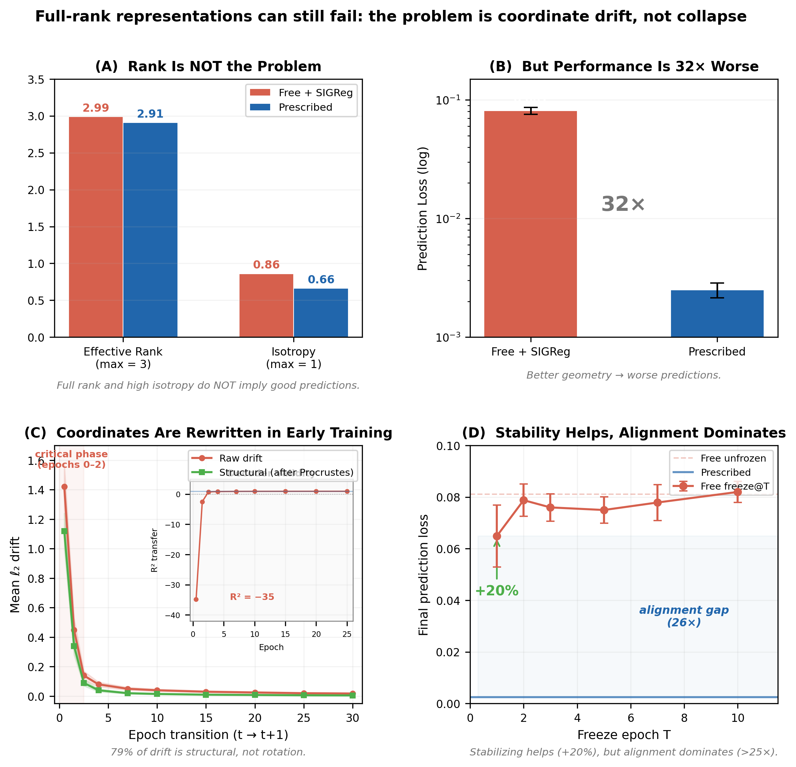

# Semantic Drift, Not Rank Collapse

**Why Stable Coordinates Matter for Learning in Joint-Embedding Spaces**

Andrey Lazarev | Independent Researcher | April 2026

→ [**Paper (PDF)**](paper.pdf)

---

## Key Result

Representational collapse in JEPA is not a rank problem — it is a coordinate stability problem.

A free encoder with SIGReg maintains full rank (2.99/3) and high isotropy (0.86) — yet loses by **233×** to a prescribed encoder with lower rank and isotropy.

### The 2×2 Factorial Design

|  | **Stable** | **Unstable** |
|---|---|---|
| **Aligned** | 0.000039 (prescribed) | 0.012849 (aligned-drifting) |
| **Not aligned** | 0.000473 (random fixed) | 0.008282 (free) |

**Stability is the prerequisite, not just a factor:**

- A random fixed encoder (no semantic content) outperforms free by **17×**
- An encoder initialized on *perfect* coordinates but allowed to drift performs **no better than free** (and sometimes worse)
- Alignment contributes 12× — but *only* when stability is maintained
- Rotated prescribed ≈ prescribed (1.09×) — interpretability is irrelevant

The two factors interact strongly: stability effect is 330× among aligned encoders but only 17.5× among unaligned ones. Alignment without stability is worthless.



**(A)** Free encoder has better geometry than prescribed. **(B)** Yet prediction is 32× worse. **(C)** Coordinate system drifts massively in early training (R² < −35 after one epoch). **(D)** Freezing the encoder helps (+20%), but alignment dominates (26× gap remains).

---

## Relation to Paper 1

This work extends [The Space Matters More Than the Loss](https://github.com/revenue7-eng/prescribed-axes) (Lazarev, 2026), which shows prescribed axes outperform free encoders across 4 modalities (5–38×). This paper identifies *why*: the free encoder's coordinate system drifts so rapidly that downstream modules cannot learn in it.

---

## Reproducing

### Quick Start (Google Colab)

**Drift + Freeze + Covariance experiments:**
1. Upload `code/paper2_colab.ipynb` to Colab
2. Run all cells (~20 min, CPU)
3. Results auto-save to Google Drive

**Random Fixed Encoder control:**
1. Upload `code/paper2_random_fixed_v2_colab.ipynb` to Colab
2. Run all cells (~15 min, CPU, 4 conditions × 3 seeds)
3. Results + figure auto-save to Google Drive

**Aligned-but-Drifting (factorial cell):**
1. Upload `code/paper2_aligned_drifting_colab.ipynb` to Colab
2. Run all cells (~20 min, CPU, 5 conditions × 3 seeds)
3. Results + factorial figure auto-save to Google Drive

### Local

```bash
pip install torch numpy scipy matplotlib
python code/paper2_full_analysis.py      # drift + freeze + covariance
python code/random_fixed_encoder.py      # random fixed control
```

### Configuration

| Parameter | Value |
|---|---|
| Seeds | 42, 123, 777 |
| Episodes | 200 per seed (synthetic Push-T physics) |
| Epochs | 30 |
| SIGReg λ | 0.09 |
| Free encoder | MLP 5→64→64→3 |
| Random fixed | Orthogonal 5→3 (normalized, frozen) |
| Prescribed | normalize(x_b, y_b, θ_b) |
| Aligned-drifting | Prescribed init → allowed to train |

---

## Repository Structure

```
paper.pdf                                  ← Main paper (7 pages, v6)
README.md                                  ← This file

code/
├── paper2_colab.ipynb                     ← Colab: drift + freeze + covariance
├── paper2_random_fixed_v2_colab.ipynb     ← Colab: random fixed encoder
├── paper2_aligned_drifting_colab.ipynb    ← Colab: aligned-but-drifting (factorial)
├── paper2_full_analysis.py                ← Complete analysis pipeline
├── drift_analysis_standalone.py           ← Drift: raw, Procrustes, R² transfer
├── covariance_analysis_standalone.py      ← Eigenspectrum, rank, isotropy
├── freeze_test_standalone.py              ← Freeze test (epochs 1,2,3,5,7,10)
├── random_fixed_encoder.py                ← Random fixed encoder (standalone)
└── generate_figures.py                    ← Reproduce all figures

results/
├── all_results.json                       ← Drift, covariance, freeze (3 seeds × 30 epochs)
├── random_fixed_v2_results.json           ← Random fixed control (4 conditions × 3 seeds)
└── aligned_drifting_results.json          ← Aligned-but-drifting (5 conditions × 3 seeds)

figures/
├── figure1_main.png                       ← Main 2×2 figure (300 dpi)
├── figure1_main.svg                       ← Main figure (vector)
├── factorial_figure.png                   ← 2×2 factorial design figure
├── fig1_geometry_fails.png
├── fig2_drift_over_time.png
├── fig3_r2_transfer.png
├── fig4_freeze_test.png
├── fig5_stability_vs_alignment.png
└── fig6_training_curves.png

reports/
├── paper_draft_v6.md                      ← Current draft (English, v6)
├── paper_draft_v5.md                      ← Previous draft (v5)
├── paper_draft_v5_ru.md                   ← Russian translation (v5)
├── paper_v6.docx                          ← Word document (v6)
└── paper_v5.docx                          ← Previous Word document (v5)
```

---

## Summary of Evidence

| Claim | Evidence | Section |
|---|---|---|
| Rank ≠ performance | rank 2.99, isotropy 0.86 → 32× worse | 3 |
| Coordinates drift | R² transfer < −35 after 1 epoch | 4.2 |
| Drift harms learning | freeze@1 → +20% | 5.1 |
| Stability alone helps | random fixed 17× better than free | 5.4 |
| Alignment adds on top | prescribed 12× better than random fixed | 5.4 |
| Interpretability irrelevant | rotated ≈ prescribed (1.09×) | 5.4 |
| Alignment without stability = worthless | aligned-drifting ≈ free | 5.5 |
| Factors not independent | stability effect: 330× (aligned) vs 17.5× (unaligned) | 5.5 |

### What is established
- Full rank is not sufficient for good predictions
- Representation drift exists and harms learning
- Coordinate stability is a prerequisite for alignment to matter
- Alignment without stability provides no benefit

### What remains open
- Encoder LR sweep / EMA baseline
- CKA/SVCCA representational similarity
- Generalization beyond 3D Push-T

---

## Citation

```bibtex
@article{lazarev2026drift,
  title={Semantic Drift, Not Rank Collapse: Why Stable Coordinates Matter
         for Learning in Joint-Embedding Spaces},
  author={Lazarev, Andrey},
  year={2026},
  url={https://github.com/revenue7-eng/prescribed-axes-drift}
}
```
